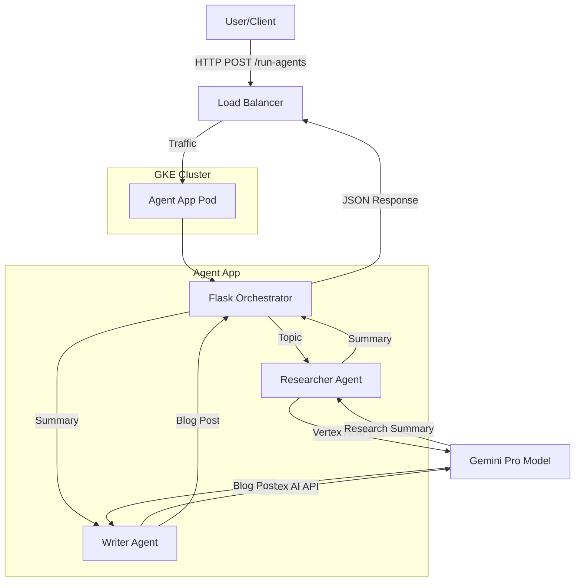

# System Architecture

This document describes the architecture of the Agentic AI application deployed on Google Kubernetes Engine (GKE).

## High-Level Overview

The system consists of a Python-based Flask application that orchestrates two AI agents (Researcher and Writer) using Google Vertex AI. The application is containerized and deployed to a GKE cluster via a CI/CD pipeline using GitHub Actions.

## Components

1.  **Flask Orchestrator (`main.py`)**:
    -   Exposes a REST API (`/run-agents`) to trigger the agent workflow.
    -   Manages the flow of data between the Researcher and Writer agents.

2.  **Agents (`agents.py`)**:
    -   **Researcher Agent**: Uses `langchain-google-vertexai` to query the Gemini Pro model. It takes a topic and produces a detailed summary.
    -   **Writer Agent**: Takes the summary from the Researcher and uses Gemini Pro to write a blog post.

3.  **Infrastructure**:
    -   **Docker**: The application is packaged into a Docker image.
    -   **Google Kubernetes Engine (GKE)**: Orchestrates the container deployment.
    -   **Kubernetes Service**: Exposes the application to the internet via a LoadBalancer.

4.  **CI/CD Pipeline**:
    -   **GitHub Actions**: Automates the build, push, and deploy process whenever changes are pushed to the `main` branch.
