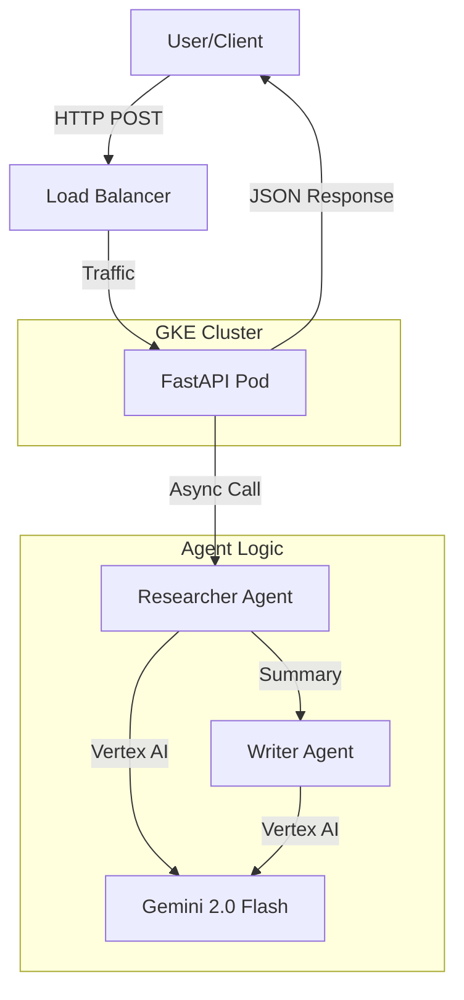

# Part 4: Architecture & Advanced Concepts

This section explains the design decisions, comparisons, and how to scale the platform.

## 1. System Architecture

*   **Compute**: GKE (Kubernetes) for scalability and control.
*   **Framework**: FastAPI for high-concurrency async handling.
*   **AI**: Google ADK + Vertex AI for enterprise-grade agent orchestration.

## 2. Why Google ADK? (vs LangChain)

We chose **Google ADK** (`google-adk`) over LangChain for this project.

| Feature | Google ADK | LangChain |
| :--- | :--- | :--- |
| **Philosophy** | "Google Native". Optimized for Vertex AI. | "Swiss Army Knife". Supports everything. |
| **Debugging** | Clean, structured traces. | Can be complex ("Spaghetti Chains"). |
| **Integration** | First-class support for Gemini/Vertex. | Community-maintained integrations. |

## 3. Observability (Tracing)

To see *why* an agent gave a specific answer, we use **Google Cloud Trace**.

*   **Native Integration**: ADK automatically sends traces to GCP if the API is enabled.
*   **View Traces**: Go to GCP Console > **Trace** > **Trace List**.
*   **What you see**: A waterfall view showing exactly how long the LLM took and what prompts were sent.

## 4. Scaling & Cost

*   **Spot Instances**: We used Spot VMs in our cluster setup. This saves ~70% on compute costs but nodes may be preempted (GKE handles this automatically).
*   **Autoscaling**: The cluster is configured to scale from 1 to 3 nodes based on load.

## 5. Future Improvements (Phase 3)

*   **MCP (Model Context Protocol)**: Connect agents to tools like Splunk or Dynatrace using standard MCP servers.
*   **Apigee**: Add an API Gateway for rate limiting and monetization.
