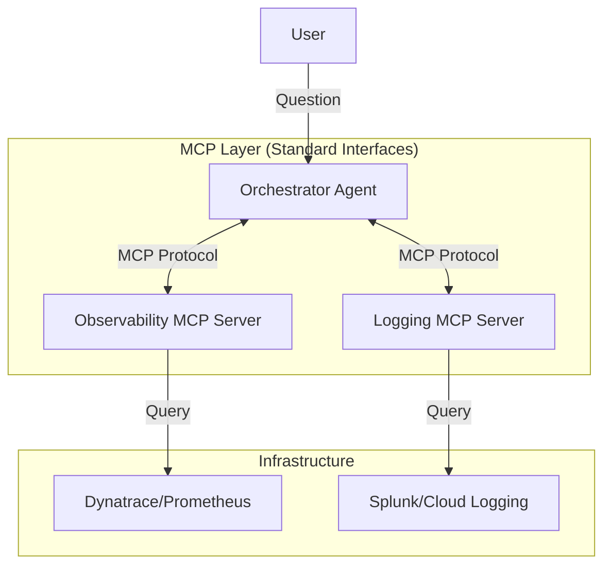

# How to Build Your Own AI Agent Using This Project

This repository is designed to be a **production-ready template** for deploying Agentic AI applications on Google Cloud. You can use it as a baseline to build completely different agents (e.g., a Customer Support Bot, a Data Analyst, or a Creative Writer) without reinventing the wheel.

## 1. Architecture Overview

Understanding the pieces will help you know what to change:

*   **The Brain (`agents.py`)**: This contains the logic. It uses **LangChain** and **Vertex AI** to define *what* the agent does.
*   **The Body (`main.py`)**: This is a **Flask** web server. It receives requests (JSON) and triggers the agents.
*   **The Container (`Dockerfile`)**: Packages everything into a lightweight image.
*   **The Infrastructure (`k8s/`)**: Kubernetes configuration to run the container on GKE.
*   **The Pipeline (`.github/workflows/`)**: Automates the build and deployment.

---

## 2. How to Customize This Project

Follow these steps to turn this "Researcher/Writer" demo into your own product.

### Step A: Define Your Agent Logic (`agents.py`)
This is where 90% of your work will happen.

1.  **Change the Prompt**: Look at the `prompt` variable in the `Agent` class.
    *   *Current*: "You are a researcher..."
    *   *New*: "You are a senior SQL analyst. Given a schema, write a query..."
2.  **Change the Model**: In `__init__`, change `model_name`.
    *   `gemini-1.5-flash`: Fast, cheap (good for simple tasks).
    *   `gemini-1.5-pro`: Smarter, more expensive (good for complex reasoning).
3.  **Add Tools**: If your agent needs to search the web or query a database, add LangChain Tools here.

### Step B: Update the API (`main.py`)
If your agent needs different inputs (e.g., a file upload instead of a text topic), change the Flask route.

1.  **Input Parsing**: Change `data = request.json`.
2.  **Orchestration**: If you have multiple agents, change how they call each other in the `/run-agents` function.

### Step C: Local Testing
Always test locally before deploying.

1.  Set your credentials: `export GOOGLE_APPLICATION_CREDENTIALS=$(pwd)/key.json`
2.  Run: `python main.py`
3.  Test: `curl -X POST http://localhost:8080/...`

---

## 3. Reusing the Infrastructure (The "Free" Stuff)

The best part of this template is that you **don't** need to touch the infrastructure code for most changes.

*   **Dockerfile**: Generic. Works for any Python app with `requirements.txt`.
*   **CI/CD (`deploy.yaml`)**: Generic. It will build *whatever* is in your folder and deploy it.
*   **Kubernetes (`k8s/`)**: Generic. It exposes port 8080.

**When to change Infrastructure:**
*   **High Memory**: If your agent loads large files, increase `memory: "512Mi"` in `k8s/deployment.yaml`.
*   **High CPU**: If you do heavy processing, increase `cpu: "250m"`.
*   **Secrets**: If your agent needs an API key (e.g., for Slack), add it as a Kubernetes Secret and mount it in `deployment.yaml`.

---

## 4. Deployment Checklist for a New Project

If you fork this repo for a new project:

1.  **Create a New GCP Project**: Don't mix environments.
2.  **Create a New Repo**: Copy the files.
3.  **Set Secrets**: Add `GCP_PROJECT_ID`, `GCP_SA_KEY`, etc., to the new GitHub repo.
4.  **Push**: The CI/CD pipeline will handle the rest.

## 5. Cost & Scaling Tips

*   **Spot Instances**: Keep `k8s/deployment.yaml` replicas low (1) and use Spot instances (as configured in our cluster setup) to save ~70%.

## 6. Advanced: Scaling to Multiple Agents (Repo Structure)

As you add more agents (e.g., `AnalystAgent`, `CoderAgent`), a flat file structure will get messy. We recommend refactoring to this modular structure:

```text
agent-gke-demo/
├── app/
│   ├── __init__.py
│   ├── main.py              # Entry point (Flask/FastAPI)
│   ├── core/                # Shared logic (Base classes, Config)
│   │   ├── __init__.py
│   │   ├── base_agent.py    # The parent Agent class
│   │   └── config.py        # Env vars and settings
│   └── agents/              # Specific agents (One folder per agent)
│       ├── __init__.py
│       ├── researcher/
│       │   ├── __init__.py
│       │   ├── agent.py     # Logic for Researcher
│       │   └── prompts.py   # Prompts for Researcher
│       └── writer/
│           ├── __init__.py
│           ├── agent.py
│           └── prompts.py
├── k8s/                     # Kubernetes manifests
├── tests/                   # Unit and Integration tests
├── Dockerfile
└── requirements.txt
```

**Why this is better:**
1.  **Separation of Concerns**: Each agent has its own folder.
2.  **Shared Core**: Common logic (like Vertex AI connection) lives in `core/`.
3.  **Scalability**: Easy to add `agents/coder/` without touching other files.

## 7. Enterprise Architecture: Using MCP (Model Context Protocol)

For an enterprise observability scenario (e.g., "Why is the checkout slow?"), you should use **MCP (Model Context Protocol)**.

Instead of hardcoding API calls to Datadog or Splunk inside your agent, you run **MCP Servers** that expose these tools in a standard way.

### Proposed Architecture



### Why MCP?
1.  **Standardization**: Your agent doesn't need to know *how* to query Splunk. It just asks the MCP server "Get logs for service X".
2.  **Security**: The MCP server handles authentication to the backend tools. The agent just needs permission to talk to the MCP server.
3.  **Reusability**: You can swap the backend (e.g., switch from Splunk to Datadog) by changing the MCP server, without rewriting the agent.

**Implementation Tip**: deploy your MCP servers as sidecars or separate services in your GKE cluster, and configure your Main Agent to connect to them via `stdio` (if local) or SSE (Server-Sent Events) over HTTP.

### 8. Thinking Tool: Evaluating MCP Deployment Patterns

When deploying MCP servers on GKE, you have two main options. Use this decision matrix to choose.

#### Option A: The Sidecar Pattern
Run the MCP server in the **same Pod** as your Agent. They talk via `localhost` or `stdio`.

*   **✅ Pros**:
    *   **Zero Latency**: Communication is instant.
    *   **Simple Auth**: No need for mTLS or tokens between them; they share the same network namespace.
    *   **Atomic Scaling**: If you scale the Agent to 10 replicas, you automatically get 10 MCP servers.
*   **❌ Cons**:
    *   **Resource Waste**: If the Agent is CPU heavy but the MCP server is idle, you waste resources scaling both.
    *   **Coupling**: Updating the MCP server requires restarting the Agent.

#### Option B: The Separate Service Pattern (Microservices)
Run the MCP server as its **own Deployment and Service**. The Agent talks to it via HTTP/SSE (e.g., `http://observability-mcp.default.svc.cluster.local`).

*   **✅ Pros**:
    *   **Independent Scaling**: Scale the Agent to 100 pods, keep the MCP server at 2 pods.
    *   **Reusability**: Multiple different Agents (e.g., "SRE Bot" and "Support Bot") can share the same MCP server.
    *   **Decoupled Deploys**: Update the MCP server without touching the Agents.
*   **❌ Cons**:
    *   **Network Latency**: Adds milliseconds to every tool call.
    *   **Security**: You need to secure the traffic (NetworkPolicies or mTLS).

#### Decision Matrix

| Criteria | Choose Sidecar | Choose Separate Service |
| :--- | :--- | :--- |
| **Coupling** | 1-to-1 (Agent uses this tool exclusively) | Many-to-1 (Many agents use this tool) |
| **State** | Stateless (e.g., Calculator) | Stateful (e.g., Caching layer, Database connection pool) |
| **Team Structure** | Same team owns Agent + Tool | Different teams (Platform Team owns Tool, Product Team owns Agent) |
| **Scaling Profile** | Symmetrical (Agent & Tool load correlates) | Asymmetrical (Agent is heavy, Tool is light) |

**Recommendation for Observability**: Start with **Option B (Separate Service)**. Your "Dynatrace MCP" will likely be used by many different agents, and it handles connection pooling to the backend, which is better done centrally.
